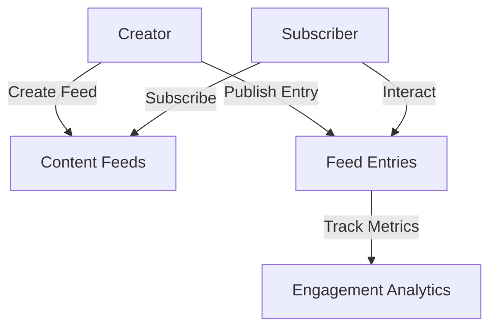

# Universal Feed - Decentralized Content Protocol

A permissionless, decentralized content and subscription management protocol built on the Stacks blockchain.

## Overview

Universal Feed enables creators and subscribers to interact through a transparent, on-chain content ecosystem, featuring:

- Decentralized content feeds
- Flexible subscription management
- Creator-controlled content publishing
- On-chain engagement tracking
- Transparent feed metrics

## Architecture

The protocol is built around a central smart contract managing content feeds, subscriptions, and entries.



### Core Components

1. **Feed Management**: Creates and tracks content feeds
2. **Subscription System**: Handles user subscriptions
3. **Content Publishing**: Allows creators to add entries
4. **Engagement Tracking**: Monitors likes and interactions

## Contract Documentation

### Main Contract: universal-feed.clar

The primary contract handling content protocol functionality.

#### Key Features:

- Content feed creation
- Subscription management
- Entry publishing
- Basic interaction tracking

#### Access Control

- Creators control their own feeds
- Subscribers can join public feeds
- Content entry restricted to feed creator

## Getting Started

### Prerequisites

- Clarinet
- Stacks wallet
- STX tokens for transactions

### Basic Usage

#### Creating a Feed

```clarity
(contract-call? .universal-feed create-feed 
    "Technology Updates"
    "Latest tech news and insights"
    "technology"
)
```

#### Subscribing to a Feed

```clarity
(contract-call? .universal-feed subscribe 
    u1 ;; feed-id
    "free" ;; subscription tier
)
```

## Function Reference

### Feed Management

```clarity
(create-feed (title (string-ascii 100)) (description (string-utf8 500)) (category (string-ascii 50)))
```

### Subscription Operations

```clarity
(subscribe (feed-id uint) (tier (string-ascii 20)))
```

### Content Publishing

```clarity
(add-entry (feed-id uint) (content (string-utf8 1000)))
```

## Development

### Testing

1. Clone the repository
2. Install Clarinet
3. Run tests:
```bash
clarinet test
```

### Local Development

1. Start Clarinet console:
```bash
clarinet console
```

2. Deploy contracts:
```bash
clarinet deploy
```

## Security Considerations

### Potential Limitations

- Relies on on-chain storage
- Basic interaction tracking
- No advanced content verification

### Best Practices

1. Verify feed and subscription details
2. Use meaningful content and categories
3. Respect community guidelines
4. Monitor feed engagement
5. Be mindful of on-chain storage costs